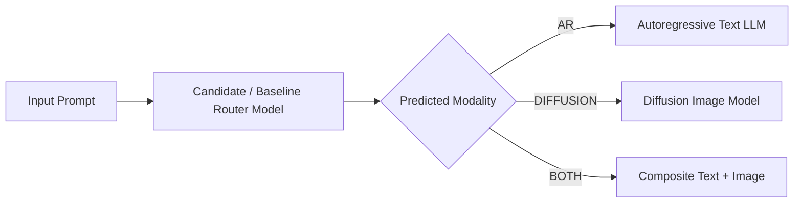
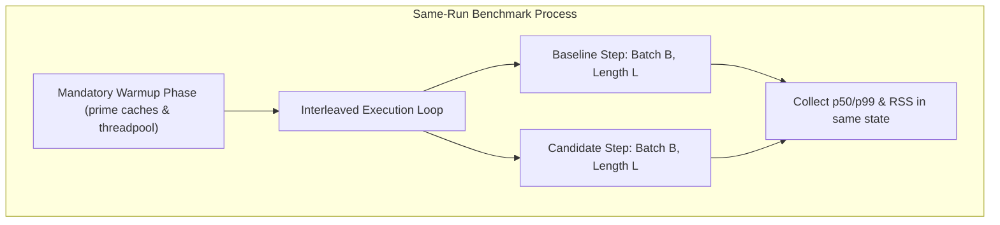
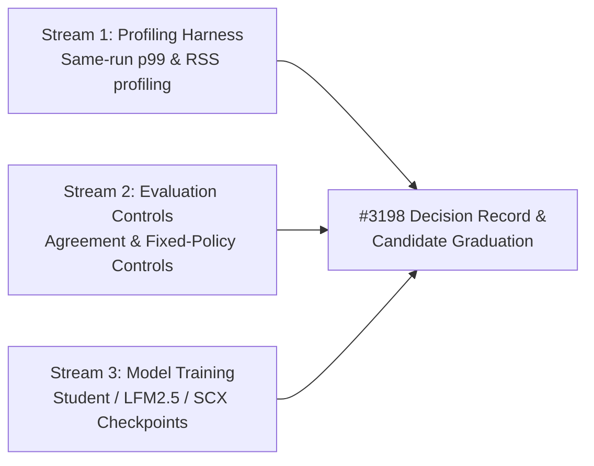

> **Status:** Decision record · **Created:** 2026-09-11 · **Issue:** [#3198](https://github.com/vllm-project/semantic-router/issues/3198) · **Parent Epic:** [#2974](https://github.com/vllm-project/semantic-router/issues/2974)

## Context and Problem

Semantic Router relies primarily on the BERT model family (such as `mmBERT-32K`) for inline classification, prompt guarding, PII detection, and embedding signals. While effective, BERT-family architectures carry latency, fixed context, and scaling trade-offs on the router's ExtProc hot path.

Parent Epic [#2974](https://github.com/vllm-project/semantic-router/issues/2974) explores routing-native model families beyond BERT. However, preselecting an alternative architecture based on novelty risks costly integration before establishing true routing value.

[Issue #3198](https://github.com/vllm-project/semantic-router/issues/3198) establishes the initial task contract, unchanged baseline, candidate classes, empirical controls, and graduation gates before broad implementation begins.

## Decision

### 1. First Task Contract: Modality Routing Classification

The first candidate experiment focuses on **Modality Routing Classification** (`src/training/model_classifier/modality_routing_classifier/`).

#### Why Modality Routing First
- **Observable Ground Truth:** Modality routing is one of the few routing problems where each request possesses an objective ground-truth target (`AR`, `DIFFUSION`, `BOTH`), unlike model-choice routing where counterfactual execution success across backends is unobservable per query.
- **Direct Router Seam:** Modality signals directly determine upstream downstream pipeline routing (e.g., dispatching to vLLM vs. Stable Diffusion / FLUX).
- **Established Data & Split:** A reproducible dataset generation and split pipeline exists in [`src/training/model_classifier/modality_routing_classifier/export_modality_dataset.py`](file:///Users/subhadeepchandra/Desktop/Projects/semantic-router/src/training/model_classifier/modality_routing_classifier/export_modality_dataset.py).

### 2. Unchanged Baseline

The baseline against which all candidates are scored is:
- **Architecture:** `mmBERT-32K` (YaRN RoPE, ModernBERT backbone) with a LoRA adapter trained on the exact deterministic split exported by `export_modality_dataset.py`.
- **Runtime Path:** Merged weights evaluated via `candle-binding` and `onnx-binding`.
- **Artifact Contract:** Labels mapped identically to `label_mapping.json` (`0: AR, 1: DIFFUSION, 2: BOTH`).

### 3. Candidate Architecture Classes

Candidates evaluated beyond BERT:

| Candidate Class | Representative Architecture | Primary Hypothesis | Key Considerations / Known Traps |
|---|---|---|---|
| **Distilled Compact Student** | MobileBERT / MiniLM-style compact encoder | Reduced parameter depth retains class boundary fidelity while cutting p99 inference latency by ≥25%. | Requires KD temperature tuning; potential degradation on multi-turn context. |
| **Hybrid Conv+Attention** | Liquid LFM2.5-Encoder (350M / 230M) | Linear/convolutional attention hybrid achieves 8K context and sub-millisecond p99 with low memory footprint. | 1) `AutoModel.from_pretrained` returns a random trunk if weights reside under `MaskedLM` prefix. 2) LR schedule requires ~3e-5 encoder / 1e-4 head (not Opir-style 1e-6). 3) 15-language pretraining vs mmBERT Glot500 multilingual coverage. |
| **Open-Label Router** | SCX Router v0.1 (Qwen3-0.6B + GLiClass head) | Zero-shot suitability prediction per model label without generative decoding; unifies routing policies. | Higher parameter count (0.6B); must verify candle/onnx runtime feasibility within memory budget. |

### 4. Non-Negotiable Evaluation Protocol

Standard offline classification accuracy is insufficient to establish routing value. All candidates must pass three required evaluation dimensions:

#### A. Routing Agreement Metric & Disagreement Attribution
Rather than aggregate accuracy alone, evaluate per-request routing decisions:
- **Routing Agreement Rate:**
  $$\text{Agreement} = \frac{1}{N}\sum_{i=1}^{N} \mathbb{I}(\hat{y}_{\text{candidate}}^{(i)} = \hat{y}_{\text{baseline}}^{(i)})$$
- **Disagreement Attribution:** For all queries where $\hat{y}_{\text{candidate}} \ne \hat{y}_{\text{baseline}}$, evaluate accuracy against ground truth:
  $$\Delta_{\text{value}} = N(\hat{y}_{\text{cand}} = y \land \hat{y}_{\text{base}} \ne y) - N(\hat{y}_{\text{base}} = y \land \hat{y}_{\text{cand}} \ne y)$$
  A candidate cannot graduate if its disagreements represent net degradation against ground truth.

#### B. Fixed-Policy Controls at Matched Cost
A learned routing model must prove value above trivial heuristic baselines. Three static controls are measured:
1. `always-cheapest`: Route 100% of requests to `AR` (lowest cost).
2. `always-strongest`: Route 100% of requests to `BOTH` (maximum capability).
3. `best fixed split at matched cost`: For the empirical average cost $\bar{C}_{\text{cand}}$ generated by the candidate model, compute the optimal static probability distribution $\mathbf{p}^* = (p_{\text{AR}}, p_{\text{DIFF}}, p_{\text{BOTH}})$ matching that cost budget:
   $$\max_{\mathbf{p}} \mathbb{E}_{\mathbf{p}}[\text{Accuracy}] \quad \text{s.t.} \quad \sum_{c} p_c \cdot \text{Cost}_c \le \bar{C}_{\text{cand}}$$
   If Candidate Accuracy $\le$ Best Fixed Split Accuracy, the model provides zero routing value over static allocation.

#### C. Same-Run Latency & Profiling Harness
Two separate benchmark runs cannot be compared because runtime bindings (`candle-binding`, `onnx-binding`) exhibit significant latency drift based on batch shape, thread pool warming, and CPU thermal throttling.
- **Protocol:** Candidate and baseline models must execute within the **same process in interleaved batches**.
- **Conditions:** Batch shapes ($B \in \{1, 4, 8, 16, 32\}$) and sequence lengths ($L \in \{64, 256, 1024\}$) held strictly identical.
- **Metrics:** p50, p90, p95, p99, p99.9 latency, peak RSS memory, and CPU utilization.

---

## Graduation Gate and Stop Criteria

### Graduation Gate
A candidate model advances to integration only if all of the following hold:
1. **Accuracy Parity:** Within $1.0\%$ Macro F1 of the mmBERT-32K baseline on the test split.
2. **Routing Agreement:** $\ge 90\%$ overall agreement with baseline, and positive net agreement ($\Delta_{\text{value}} > 0$) on the disagreement subset.
3. **Control Outperformance:** Statistically significant ($p < 0.01$) accuracy gain over the cost-matched best fixed split control.
4. **Latency Improvement:** At least $20\%$ lower p99 latency at batch size 1 in the same-run runtime binding harness.
5. **Memory Constraint:** Peak resident memory within $\le 1.25\times$ of baseline, staying within the ExtProc container budget (< 1 GB total).

### Stop Criteria
The experiment stops and the candidate is rejected if:
- The candidate fails to outperform the cost-matched static split control (demonstrating that learned routing adds no marginal value).
- Same-run p99 latency in `candle-binding` / `onnx-binding` is worse than or equal to baseline despite smaller parameter count (e.g., due to unsupported custom kernels or lack of AVX512/AMX acceleration).
- Multilingual accuracy drops by $> 5\%$ on non-English evaluation splits.

---

## Work Breakdown Structure

To maintain clean ownership across contributors, work is partitioned into three decoupled streams:

1. **Stream 1 (Profiling Harness):** Same-run profiling harness (`same_run_profile_harness.py`) executing interleaved baseline and candidate inferences with batch shape and warm state held fixed.
2. **Stream 2 (Evaluation Controls):** Evaluator (`evaluate_routing_agreement_and_controls.py`) computing routing agreement rate, disagreement attribution, and cost-matched static controls (`always-cheapest`, `always-strongest`, `best-fixed-split`).
3. **Stream 3 (Candidate Experiment & Decision Record):** Issue #3198 records the reviewed decision, trains candidate models against the modality routing contract, and applies the graduation gate.

---

## References

- [Issue #3198: Research routing-native task contracts and baselines](https://github.com/vllm-project/semantic-router/issues/3198)
- [Parent Epic #2974: Develop routing-native Router Model families beyond BERT](https://github.com/vllm-project/semantic-router/issues/2974)
- [Modality Routing Classifier README](file:///Users/subhadeepchandra/Desktop/Projects/semantic-router/src/training/model_classifier/modality_routing_classifier/README.md)
- [Batch and Capacity-Aware Routing Decision Record](./batch-and-capacity-aware-routing)
